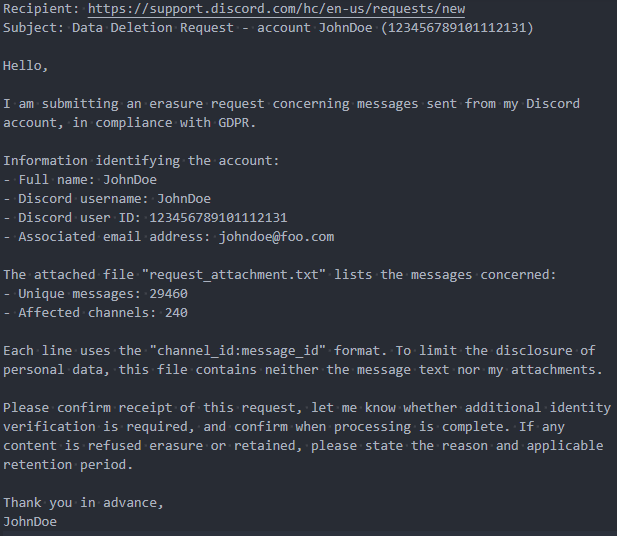
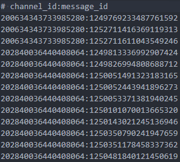

<div align="center">

# Discord Purger

</div>

<p align="center">
  <strong>A CLI tool that generates text requesting the deletion of personal data from Discord.</strong>
</p>

<p align="center">
  <a rel="license" href="https://www.gnu.org/licenses/gpl-3.0.en.html"></a>
  
  
  
  
</p>

Discord Purger is a command-line program that parses a [Discord personal data archive](https://support.discord.com/hc/en-us/articles/360004027692-Requesting-a-Copy-of-your-Data) to extract a list of message IDs, then generates a text that can be sent to Discord to request data deletion.

This program is intended for users who want to request the deletion of messages associated with their Discord account without manually collecting every message identifier. It produces a list of unique message references and a draft email that summarizes the request.

The analysis is performed entirely on the local computer. The program does not connect to Discord, send an email, upload the data package, delete messages, or submit a request automatically.

<p align="center">
  <a href="#-features">Features</a> &nbsp;&bull;&nbsp;
  <a href="#-overview">Overview</a> &nbsp;&bull;&nbsp;
  <a href="#-usage">Usage</a> &nbsp;&bull;&nbsp;
  <a href="#️-development">Development</a> &nbsp;&bull;&nbsp;
  <a href="#-resources">Resources</a> &nbsp;&bull;&nbsp;
  <a href="#-contributing">Contributing</a> &nbsp;&bull;&nbsp;
  <a href="#️-credits">Credits</a> &nbsp;&bull;&nbsp;
  <a href="#️-license">License</a>
</p>

## ✨ Features

- **Privacy protection** - No internet connection is required; everything runs locally, and no data is sent.
- **A simple and practical tool** - Discord Purger intentionally provides a limited feature set so that it remains accessible and easy for everyone to use.
- **High-quality code** - Thanks to strict linting rules and rigorous testing, the software is built on a reliable, robust codebase. The code aims to be as Pythonic as possible.

## 💠 Overview

### Screenshots

<figure>
  
  
  <figcaption>Example of a generated text and its attachment</figcaption>
</figure>

### Built with

- [Miniconda](https://www.anaconda.com/docs/getting-started/miniconda/main) - The package and environment manager
- [Python 3](https://www.python.org/) - The programming language
- [Ruff](https://docs.astral.sh/ruff/) - A code formatter and linter used to catch bugs

## 📖 Usage

Discord Purger analyzes the Discord data downloaded by the user, writes the IDs of the messages it finds to `data/request_attachment.txt`, and generates the text to submit to Discord in `data/request_message.txt`, allowing the user to exercise their [right to erasure](https://support.discord.com/hc/en-us/articles/5431812448791-How-long-Discord-keeps-your-information).

The goal is therefore not to delete Discord data directly using a bot, as [such use](https://support.discord.com/hc/en-us/articles/115002192352-Automated-User-Accounts-Self-Bots) may result in the account being banned.

### Deletion request procedure

1. Request a Discord personal data archive by going to **Parameter -> Data & Privacy-> Request Data**. See the page [*Your Discord Data*](https://support.discord.com/hc/en-us/articles/360004957991-Your-Discord-Data-Package) for more details.

2. Once the archive has been received, move it to the `data/` directory and rename it `discord_data.zip`, or extract it to `data/discord_data/`. The script can process either format.

3. Open a terminal in the folder containing the project, then run Discord Purger with the command:

    ```bash
    python main.py [--data-source "<DATA_PATH>"] [--full-name "<FULL_NAME>"]
    ```

    Replace the following:

      - `<DATA_PATH>` (optional): A relative or absolute path to the archive or extracted directory. If this argument is omitted, the program first uses `data/discord_data.zip` if the archive exists; otherwise, it uses `data/discord_data/`. An error is raised if neither exists.
      - `<FULL_NAME>` (optional): The user's first and last name. If this argument is omitted, the extracted Discord username is used by default.

    Once execution is complete, the message IDs and their associated channel IDs are written to `data/request_attachment.txt`, and the text to submit is saved to `data/request_message.txt`.

4. Open the generated `data/request_message.txt` file in a text editor.

5. Using a web browser, go to Discord's [Submit a request](https://support.discord.com/hc/en-us/requests/new)page, then complete the form as follows:
    - **What can we help you with?**: Select `Contact Discord Privacy`.
    - **Subject**: Insert the text following *Subject:* from `request_message.txt`.
    - **Description**: Insert the body of the text from `request_message.txt`.
    - **What do you need assistance with?**: Select `Delete your personal data on Discord`.
    - Select **Have you read the following Discord articles?**.
    - **Attachments**: Select the generated `data/request_attachment.txt` file, which contains the list of messages to be deleted.

6. Click **Submit** to send the request.

### Script usage

Discord Purger is a Python command-line (CLI) program that is run directly with a Python interpreter.

#### Syntax

```bash
python main.py [OPTIONS]...
```

Where:

- `[OPTIONS]`: Zero or more [script options](#options).

To display the help information, run:

```bash
python main.py -h
# or
python main.py --help
```

#### Options

| Option | Action |
| ------ | ------ |
| `-h` or `--help` | Display up-to-date help information and exit. |
| `-data <path>` or `--data-source <path>` | Path to the directory or ZIP archive containing the Discord data. If no path is specified, the program first uses `data/discord_data.zip`, followed by `data/discord_data/`. An error is raised if neither exists. |
| `-o <path>` or `--output-dir <path>` | Path to the directory in which the generated files will be created. |
| `--full-name <firstname> <lastname>` | The full name to include in the generated text to send. If no full name is specified, the program uses the extracted Discord username. |
| `--force` | Replace output files if they already exist. |
| `--dry-run` | Analyze the data without writing any output files. |

#### Examples

To analyze the data without generating any files:

```bash
python main.py --dry-run
```

To run the program with custom paths and overwrite previously generated files:

```bash
python main.py --data-source "documents/discord_data/" --output-dir "documents/" --force
# or
python main.py --data-source "documents/discord.zip" --output-dir "documents/" --force
# or
python main.py -data "documents/discord.zip" -o "documents/" --force
```

### Generated text template

Input enclosed in `<...>` are automatically replaced by the program using information extracted from the Discord data.

```text
Recipient: https://support.discord.com/hc/en-us/requests/new
Subject: Data Deletion Request - account <USERNAME> (<USER_ID>)

Hello,

I am submitting an erasure request concerning messages sent from my Discord
account, in compliance with GDPR.

Information identifying the account:
- Full name: <FULL_NAME|USERNAME>
- Discord username: <USERNAME>
- Discord user ID: <USER_ID>
- Associated email address: <EMAIL>

The attached file "request_attachment.txt" lists the messages concerned:
- Unique messages: <NB_MESSAGES>
- Affected channels: <NB_CHANNELS>

Each line uses the "channel_id:message_id" format. To limit the disclosure of
personal data, this file contains neither the message text nor my attachments.

Please confirm receipt of this request, let me know whether additional identity
verification is required, and confirm when processing is complete. If any
content is refused erasure or retained, please state the reason and applicable
retention period.

Thank you in advance,
<FULL_NAME|USERNAME>
```

## 🛠️ Development

### Prerequisites

To build, test, and deploy Discord Purger, the following tools are required:

- [Conda or Miniconda (latest version)](https://anaconda.org/).
- [Python 3.14 or later](https://www.python.org/).
- [The pip package management tool](https://www.anaconda.com/docs/getting-started/working-with-conda/packages/pip-install).

To verify that Conda, Python, and pip are installed, open a terminal and run:

```bash
conda --version
python --version
pip --version
```

If all commands return a version number, the installation is successful.

If an error occurs, download and install Miniconda by following the [official documentation](https://www.anaconda.com/docs/getting-started/miniconda/install/overview).

### Development tools

The application is primarily developed using Visual Studio Code, which provides useful integrations tools that speed up development and simplify debugging.

[Visual Studio Code](https://code.visualstudio.com/) is therefore recommended, along with the following extensions:

- [Python](https://marketplace.visualstudio.com/items?itemName=ms-python.python) (see [the documentation](https://github.com/Microsoft/vscode-python)).
- [Python Debugger](https://marketplace.visualstudio.com/items?itemName=ms-python.debugpy) (see [the documentation](https://github.com/microsoft/vscode-python-debugger)).
- [Python Environments](https://marketplace.visualstudio.com/items?itemName=ms-python.vscode-python-envs) (see [the documentation](https://github.com/microsoft/vscode-python-environments)).
- [Pylance](https://marketplace.visualstudio.com/items?itemName=ms-python.vscode-pylance) (see [the documentation](https://github.com/microsoft/pylance-release)).
- [Ruff extension](https://marketplace.visualstudio.com/items?itemName=charliermarsh.ruff) (see [the documentation](https://docs.astral.sh/ruff/)).

### Setup the environment

1. Open a terminal in the folder containing the project, then create and activate a virtual environment with Conda:

    ```bash
    conda create -n <ENV_NAME> python=<PYTHON_VERSION>
    conda activate <ENV_NAME>
    ```

    Replace the following:

    - `<ENV_NAME>` : A meaningful name for the environment.
    - `<PYTHON_VERSION>` : The installed Python version (Discord Purger uses Python 3.14.4).

2. Install the dependencies using one of the following methods:

    - To install them *all at once*:

      ```bash
      pip install -r requirements.txt
      ```

    - To install them *one by one*:

      ```bash
      pip install requests
      pip install types-requests
      ```

3. Verify that the installation was successful by running Discord Purger:

    ```bash
    python "main.py"
    ```

    The Discord Purger development environment is now ready.

### Useful commands

Several *commands* and *scripts* are available for developing this project, including building the application, generating documentation, running tests, and deploying it. The scripts are stored in the `dist/` folder, and the commands can be run from a terminal.

For VS Code users, all commands are defined as [**Visual Studio Code** tasks](https://code.visualstudio.com/docs/debugtest/tasks) in `.vscode/tasks.json` and can be launched from the [command palette](https://code.visualstudio.com/docs/editor/tasks).

The usage of commands and scripts is described below in the order of a typical development workflow. They must be executed from the root project directory:

- To **run** the application (execute the main file):

  ```bash
  python "main.py" --force
  ```

  - VS Code task: `App: Run`.

- To **run the tests** (execute the `pytest` command):

  ```bash
  pytest
  ```

  - VS Code task: `App: Test`.

### Project structure

```text
project-root/
├── .vscode/                       # IDE workspace configuration
│   ├── extension.json             # Recommended VS Code extensions to use
│   ├── launch.json                # VS Code debugging configuration
│   ├── settings.json              # Local VS Code settings
│   └── tasks.json                 # Custom build and automation tasks for VS Code
├── data/                          # Input data and generated output files
├── docs/                          # Project documentation (Markdown files)
├── logs/                          # Application runtime logs and debugging output
├── sample/                        # Examples of communications or code
├── tests/                         # Unit, functional, and integration tests
├── LICENSE.md                     # Project license information
├── main.py                        # Application entry point
├── pyproject.toml                 # Project configuration (build system, dependencies, tools)
├── README.md                      # Project overview and main documentation
├── requirements.txt               # List of Python dependencies required to run the project
└── ruff.toml                      # Linting and code formatting configuration (Ruff)
```

### Code conventions

The Discord Purger codebase must follow the [PEP 8 style guide](https://peps.python.org/pep-0008/), the existing naming conventions, and the [Google Python Style Guide](https://google.github.io/styleguide/pyguide.html) for docstrings. Linting and formatting is performed using [Ruff](https://docs.astral.sh/ruff/) with the `ruff.toml` file located at the project root.

When using VS Code, the [Ruff extension](https://marketplace.visualstudio.com/items?itemName=charliermarsh.ruff) is strongly recommended to display issues and format the code using the `Ruff: Format document` and `Ruff: Format imports` commands. Similarly, the [Pylance extension](https://marketplace.visualstudio.com/items?itemName=ms-python.vscode-pylance) is strongly recommended for static type checking.

Coding style:

- [PEP 8 style guide](https://peps.python.org/pep-0008/)
- [Google Python Style Guide](https://google.github.io/styleguide/pyguide.html) for docstrings

Code formatting:

- [Ruff](https://docs.astral.sh/ruff/)

Code linting:

- [Ruff](https://docs.astral.sh/ruff/)
- [Pylance](https://github.com/microsoft/pylance-release)

### Commit message guidelines

Git commit messages should follow the [Conventional Commits specification](https://www.conventionalcommits.org/) to maintain a clear and informative project history:

- `feat`: New features.
- `fix`: Bug fixes.
- `docs`: Documentation updates.
- `style`: Code style changes.
- `refactor`: Code refactoring without changing functionality.
- `test`: Adding or modifying tests.
- `chore`: Maintenance tasks.
- `merge`: Merging branches or pull requests. Examples:
  - `merge: feature-branch-xxx into feature-branch`
  - `merge: remote feature-branch into local feature-branch`
  - `merge: pull request #12 from feature-branch`

## 📚 Resources

General links:

- [PEP 8 style guide](https://peps.python.org/pep-0008/)
- [Google Python Style Guide](https://google.github.io/styleguide/pyguide.html)
- [Conventional Commits specification](https://www.conventionalcommits.org/)

Other tools documentation:

- [Ruff](https://docs.astral.sh/ruff/)
- [Python VS Code extension](https://github.com/Microsoft/vscode-python)
- [Python Debugger VS Code extension](https://github.com/microsoft/vscode-python-debugger)
- [Python Environments VS Code extension](https://github.com/microsoft/vscode-python-environments)
- [Pylance VS Code extension](https://github.com/microsoft/pylance-release)

Discord:

- [Requesting a Copy of your Data](https://support.discord.com/hc/en-us/articles/360004027692-Requesting-a-Copy-of-your-Data)
- [Form to submit a request](https://support.discord.com/hc/en-us/requests/new)

## 🤝 Contributing

Contributions are not being accepted because the project is complete.

## ❤️ Credits

This project is maintained and developed by [Joseph Garnier](https://www.joseph-garnier.fr/).

## ©️ License

This work is licensed under the terms of the <a href="https://www.gnu.org/licenses/gpl-3.0.en.html" target="_blank" rel="license noopener noreferrer" style="display:inline-block;">GNU GPLv3</a>. See the [LICENSE.md](LICENSE.md) file for details.
